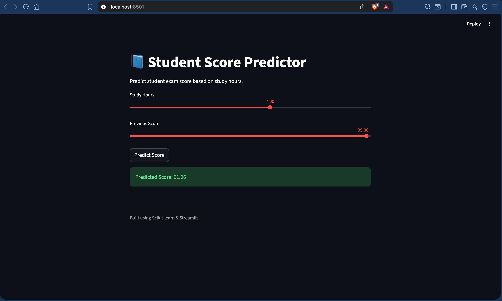

# 📚 Student Score Prediction using Machine Learning

[](https://student-score-prediction-prianshu.streamlit.app/)

A Machine Learning project that predicts student scores based on study-related factors using regression techniques.

---

## 🚀 Demo

Predict student scores interactively using a Streamlit web app.

---

## 🛠 Tech Stack

- Python
- Pandas
- NumPy
- Scikit-learn
- Matplotlib
- Streamlit

---

## 📂 Project Structure

```bash
student-score-prediction/
│
├── data/
├── notebook/
├── model/
├── app/
├── screenshots/
├── requirements.txt
└── README.md
```

---

## 📊 Features

- Linear Regression model
- Model evaluation
- Interactive Streamlit UI
- Model persistence using Pickle

---

## ▶️ Run Locally

Clone repository:

```bash
git clone https://github.com/prianshu-kumar/Student-score-prediction.git
```

Install dependencies:

```bash
pip install -r requirements.txt
```

Run Streamlit app:

```bash
streamlit run app/app.py
```

---

## 📸 App Screenshot



---

## 📈 Future Improvements

- Multiple feature prediction
- Better UI
- Advanced regression models
- Deployment

---

## 👨‍💻 Author

Prianshu